# Photo Sphere XMP Metadata reference

This repository aims to clarify and explain as clearly as possible how EXIF tags
and the Google Photo Sphere XMP schema should work, including 15 test images
that already contain the embedded metadata to be tested and viewed in any 360
image viewer.

## Google Photo Sphere XMP schema

> After thoroughly reading and testing each tag, including translating them
> into other languages and discovering serious wording errors like *"from
> North, for **the** center **the** image"* I decided to add my own wording to
> the [GPano
> specs](https://developers.google.com/streetview/spherical-metadata#gpano_parameter_reference).
> I know these parameters have not been implemented correctly in virtually any
> 360-degree panorama viewer and I guess the issue is the lack of clarity on
> the definitions.
>
> To make the pose tags easier to understand, think the point of reference as a
> 3D sphere stuck to the Earth’s surface, pointing north and perfectly leveled
> with earths horizon, like a little 3D sphere attached to a much larger 3D
> sphere (the Earth). This is why the **X-axis points East**, and the **Y-axis
> points North** and the **Z-axis points up** from the 3D sphere perspective.
> Our panorama image is the texture of that 3D sphere, the Pose tags moves the
> image texture having the center of our panorama image (pivot) relative to the
> 3D sphere North which is fixed in 3D space. The initial view moves the camera
> inside the 3D sphere relative to the 3D space rather than to the panorama
> image itself.
>
> In short, all the **pose tags** set the position of the texture (our panorama
> image) in relation of a 3D sphere that it is static in a 3D space, all the
> **initial view tags** move the 3D camera inside the static 3D sphere in that
> 3D space.

* **GPano:PoseHeadingDegrees:**  
  Defines the distance in clockwise degrees from the 3D sphere north to the
  center of the panorama image.  
  **Exiftool argument:** `-XMP-GPano:PoseHeadingDegrees`  
  **Value:** Degrees, `>= 0` to `< 360`  
  **Example:** Set to `270` if from the panorama image perspective, the true
  North is located East, because from the perspective of the 3D sphere North,
  the image center is `-90°`, but we can't use negative numbers, so from the 3D
  sphere North to the panorama image center there are `270°` using a clockwise
  direction.

* **GPano:PosePitchDegrees**  
  Defines in degrees the pitch between the 3D sphere horizon to the center of
  the image. Positive values move the image center horizon up, negative values
  move the image center horizon down.  
  **Exiftool argument:** `-XMP-GPano:PosePitchDegrees`  
  **Value:** `>= -90` to `<= 90`  
  **Example:** Set to `5` if the horizon at the center of your image shows a
  point that is `-5°` below the 3D sphere horizon or true horizon.

* **GPano:PoseRollDegrees**  
  Defines, in degrees, the roll of the image relative to the 3D sphere horizon
  or real-world horizon, applied as the image is mapped onto the 3D sphere. A
  value of 0 means the horizon is level. As the value increases, the horizon
  visually rotates counterclockwise within the image (and, correspondingly,
  within the sphere it's textured onto).  
  **Exiftool argument:** `-XMP-GPano:PoseRollDegrees`  
  **Value:** `> -180` to `<= 180`  
  **Example:** If the horizon in your image is tilted `5°` clockwise, set `5`
  to level it, because positive numbers move the panorama image
  counterclockwise in relation to the 3D sphere.

* **GPano:InitialViewHeadingDegrees**  
  Heading of the initial view (what the user sees first), in degrees clockwise
  from 3D sphere North. Not relative to the panorama image center but relative
  to the 3D sphere or real-world, in other words, it moves the camera left and
  right.  
  **Exiftool argument:** `-XMP-GPano:InitialViewHeadingDegrees`  
  **Value:** `>= 0` to `< 360`

* **GPano:InitialViewPitchDegrees**  
  Pitch of the initial view, in degrees above the 3D sphere horizon. Not
  relative to the panorama image center but relative to the 3D sphere or
  real-world. In other words, tilts the camera in 3D space, positive numbers
  tilt the camera up, negative numbers tilt the camera down.  
  **Exiftool argument:** `-XMP-GPano:InitialViewPitchDegrees`  
  **Value:** `>= -90` to `<= 90`

* **GPano:InitialViewRollDegrees**.  
  Roll of the initial view. Level with the 3D sphere horizon, a value of 0
  means the horizon is level. As the value increases, the horizon in the view
  rotates counterclockwise because we are moving the 3D camera clockwise.  
  **Exiftool argument:** `-XMP-GPano:InitialViewRollDegrees`  
  **Value:** `> -180` to `<= 180`

## Sample images

These sample images are designed to test any 360° panorama viewer by testing
each of the GPano tags that deal with the visual orientation of the panorama
image. The first 6 images deal with the Pose tags, images 7 to 12 deal with the
Initial View tags, 13 combines the Pose Heading tag with the Initial View tag,
14 combines all of the Pose tags, and 15 tests gimbal lock. Here is the table
of the tags defined on each image, also, the included `exiftool_commands.sh`
show the `exiftool` commands used to set the metadata:

|                                   |      Pose      |              |             |   InitialView  |              |             |
|-----------------------------------|:--------------:|:------------:|:-----------:|:--------------:|:------------:|:-----------:|
| Test Name                         | HeadingDegrees | PitchDegrees | RollDegrees | HeadingDegrees | PitchDegrees | RollDegrees |
| North at +45                      | 315            | 0            | 0           | 0              | 0            | 0           |
| North at -45                      | 45             | 0            | 0           | 0              | 0            | 0           |
| Horizon Below 5                   | 0              | 5            | 0           | 0              | 0            | 0           |
| Horizon Above 5                   | 0              | -5           | 0           | 0              | 0            | 0           |
| Horizon tilted 5 cw               | 0              | 0            | 5           | 0              | 0            | 0           |
| Horizon tilted 5 ccw              | 0              | 0            | -5          | 0              | 0            | 0           |
| Initial View at +45               | 0              | 0            | 0           | 45             | 0            | 0           |
| Initial View at -45               | 0              | 0            | 0           | 315            | 0            | 0           |
| Initial View Pitch +5             | 0              | 0            | 0           | 0              | 5            | 0           |
| Initial View Pitch -5             | 0              | 0            | 0           | 0              | -5           | 0           |
| Initial View  Roll +5             | 0              | 0            | 0           | 0              | 0            | 5           |
| Initial View  Roll -5             | 0              | 0            | 0           | 0              | 0            | -5          |
| North at -45, Initial View at +45 | 45             | 0            | 0           | 45             | 0            | 0           |
| All Pose Combined                 | 45             | 5            | 5           | 0              | 0            | 0           |
| Pitch gimbal lock                 | 0              | 90           | 0           | 0              | 0            | 0           |

## Correct viewing

For these tests, in an ideal viewer, all of the pose tags should place the
image texture correctly onto the 3D sphere. Some images have the pixel data
modified to test the correct tag interpretation: images 1, 2, 13, and 14
visually have the compass heading offset from the image center; images 3 and 4
visually have the pitch drifted; and images 5 and 6 visually have the roll also
drifted. All of these modifications are intended to test the panorama viewer's
corrections. Heading corrections can be visually reviewed with the compass at
the bottom of the image. Image 14 has the pitch, roll, and heading visually
modified, and image 15 has a +90° pitch visually modified to test gimbal lock
in the viewer.

You can test the images in https://tools.rodrigopolo.com/360PanoMeta/

| Equirectangular                                                                             | No metadata                                                                                     | Corrected                                                                                     |
|---------------------------------------------------------------------------------------------|-------------------------------------------------------------------------------------------------|-----------------------------------------------------------------------------------------------|
| 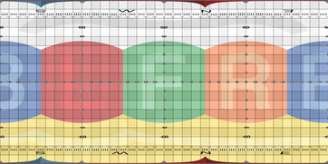                                           | 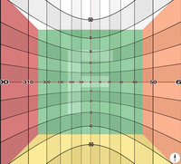                                             | 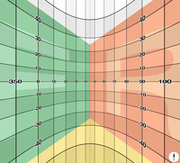                                           |
| 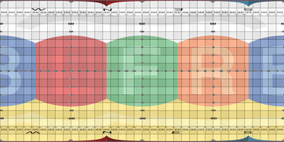                                           |                                              | 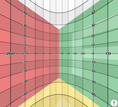                                           |
| 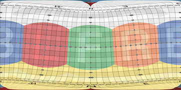                                     | 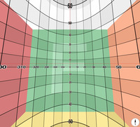                                       |                                      |
| 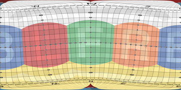                                     |                                        | 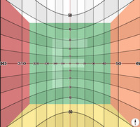                                     |
| 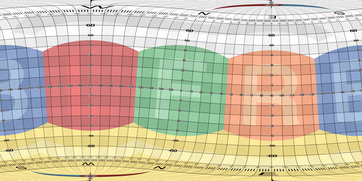                             | 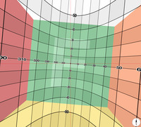                               | 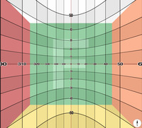                             |
| 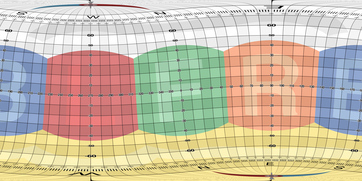                           | 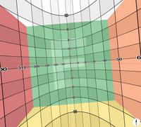                             |                            |
| 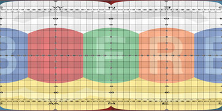                             | 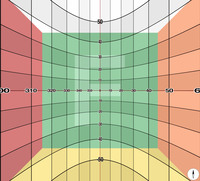                               | 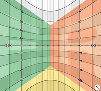                             |
|                              |                                | 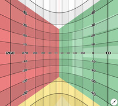                             |
|                          |                            | 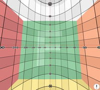                         |
|                          |                            | 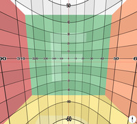                         |
|                            |                              | 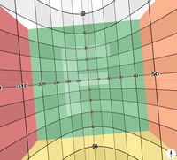                           |
|                            |                              | 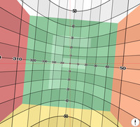                           |
|  |    |  |
| 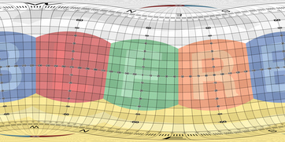                                 | 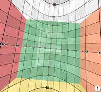                                   |                                  |
| 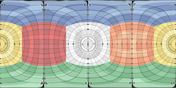                                 | 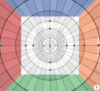                                   |                                  |

## License

MIT License - Copyright © 2026 Rodrigo Polo.